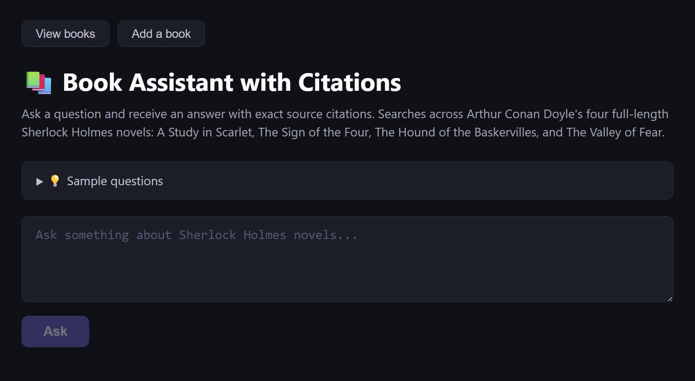
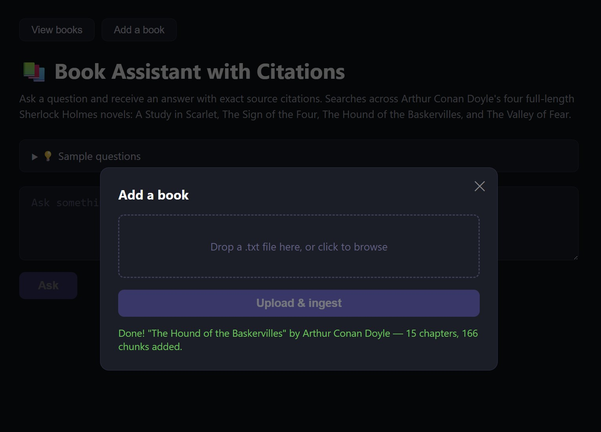
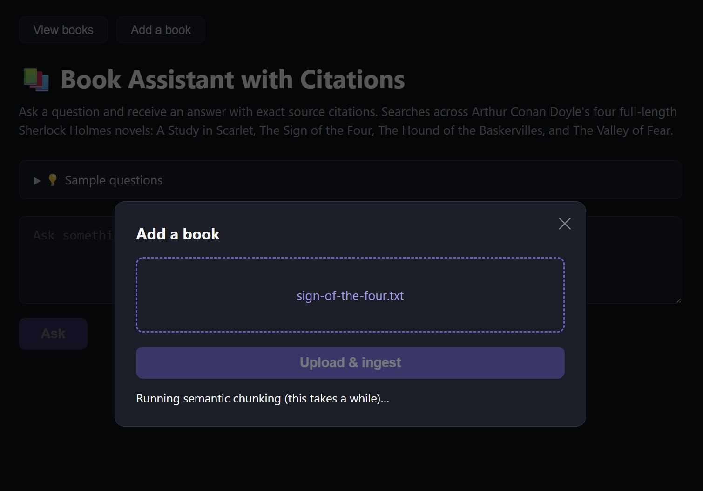
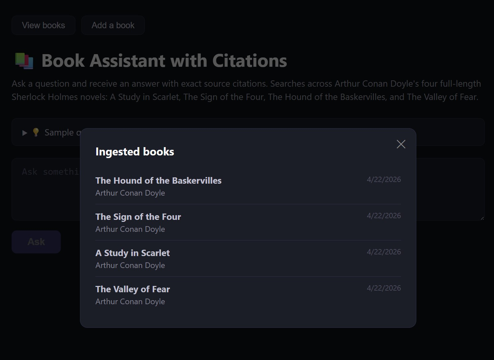
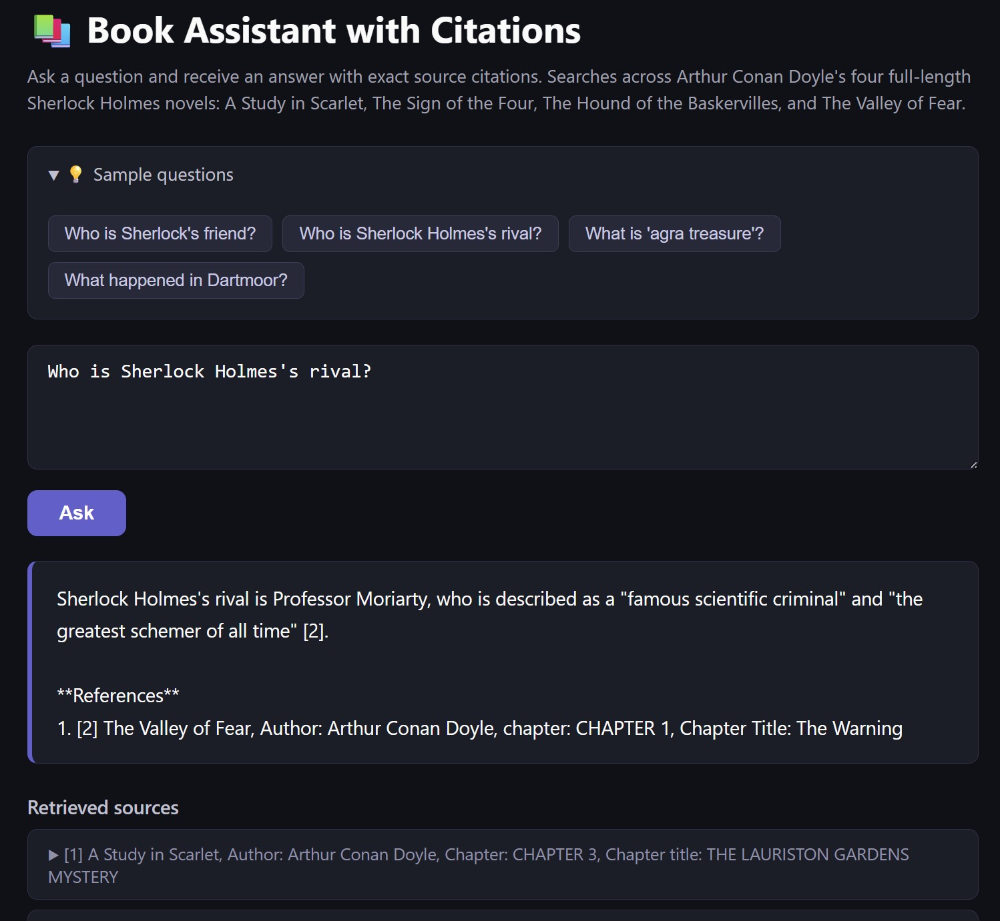

# 221B Baker Street Retrieval

A RAG (Retrieval-Augmented Generation) application that lets you ask questions about a library of books and receive
answers with exact source citations. Originally built around Arthur Conan Doyle's Sherlock Holmes novels, the app now
accepts any plain-text book at runtime via an upload endpoint.

## Screenshots

The main UI: a question box, sample questions, and tabs to add or view books.



Uploading a new book - success state showing chapters parsed and chunks added.



Ingestion in progress, with the worker running semantic chunking in the background.



Viewing all ingested books from the registry.



Asking a question and receiving a grounded answer with inline citations and the retrieved source passages.



## What it does

You ask a question, and the app retrieves the most relevant passages from the ingested books, feeds them to an LLM, and
returns a grounded answer with inline citations pointing back to the specific book and chapter each fact came from. It
will not speculate or draw on outside knowledge; every claim in the answer is backed by a retrieved source.

The UI is a small Jinja2 web page served by FastAPI with a question box, an upload form for new books, and expandable
source cards showing the raw retrieved passages beneath each answer.

## Tech stack

| Layer         | Technology                                                                                |
|---------------|-------------------------------------------------------------------------------------------|
| Web framework | [FastAPI](https://fastapi.tiangolo.com/) + [Uvicorn](https://www.uvicorn.org/)            |
| UI            | Jinja2 templates served by FastAPI                                                        |
| Task queue    | [Celery](https://docs.celeryq.dev/) workers, [RabbitMQ](https://www.rabbitmq.com/) broker |
| LLM           | OpenAI `gpt-4o` via [LangChain](https://www.langchain.com/)                               |
| Embeddings    | OpenAI `text-embedding-ada-002` (`OpenAIEmbeddings`)                                      |
| Vector store  | [ChromaDB](https://www.trychroma.com/) (persisted to `chroma_db/`)                        |
| Chunking      | LangChain `SemanticChunker` (splits by semantic similarity rather than fixed token size)  |
| Config        | `pydantic-settings` reading from `.env`                                                   |
| Packaging     | Docker + Docker Compose (api, worker, rabbitmq)                                           |

## Architecture

Three services run together via Docker Compose:

- **`api`**: FastAPI/Uvicorn process that serves the UI, accepts uploads, and answers queries against the vector store.
- **`worker`**: Celery worker that handles book ingestion (parsing, semantic chunking, embedding, writing to Chroma) in
  the background so uploads don't block the request thread.
- **`rabbitmq`**: message broker the API uses to hand ingestion jobs to the worker.

The API and worker share the same image (built from the `Dockerfile`) and the same named volumes for
`chroma_db/` (vector store) and `uploads/` (temp files during ingestion). They are tracked in `book_registry.json`,
which prevents the same title from being ingested twice.

## Book format

Books are uploaded at runtime as plain `.txt` files. To keep formatting consistent across editions, each file should
include a small header at the top:

```
TITLE: <book title>
AUTHOR: <author name>
```

Chapter headings should follow the pattern `CHAPTER <number>`, with an optional `C NAME: <chapter title>` line
immediately after.

The Sherlock Holmes novels used during development are public-domain texts from
[Project Gutenberg](https://www.gutenberg.org/): *A Study in Scarlet*, *The Sign of the Four*,
*The Hound of the Baskervilles*, and *The Valley of Fear*. Any text following the format above will work.

## Setup

### 1. Configure environment

Copy the example env file and fill in your OpenAI key:

```bash
cp .env.example .env
# then edit .env and set OPENAI_API_KEY
```

### 2. Run with Docker Compose (recommended)

```bash
docker compose up --build
```

This builds the shared image and starts all three services. On first run, RabbitMQ may take ~10 seconds to become
healthy before the api/worker containers start.

Once running:

- App UI: <http://localhost:8000>
- RabbitMQ management UI: <http://localhost:15672> (user/pass: `guest`/`guest`)

The `chroma_db/` and `uploads/` directories are mounted as named volumes, so ingested data survives container restarts
and rebuilds.

### 3. Run locally without Docker (optional)

You'll need a running RabbitMQ instance reachable at the URL in `.env`.

```bash
pip install -r requirements.txt

# in one shell
uvicorn app.main:app --reload

# in another shell
celery -A celery_app worker --loglevel=info
```

## Using the app

1. **Upload a book**: open the UI and submit a `.txt` file via the upload form (or `POST /ingest` directly with a
   multipart file). The API returns a `task_id` immediately; the worker parses, chunks, embeds, and writes to Chroma in
   the background. Poll `GET /tasks/{task_id}` to watch progress (`PENDING` -> `STARTED` with a `step` field ->
   `SUCCESS`
   or `FAILURE`).
2. **Ask a question**: type a question into the query box (or `POST /query` with `{"question": "..."}`). The top 10
   most relevant chunks are retrieved and passed to `gpt-4o` with a strict citation-only prompt. The response includes
   the answer text with inline `[n]` citations and the raw source passages.
3. **List ingested books**: `GET /books` returns the registry of ingested titles.

## API endpoints

| Method | Path          | Purpose                                                |
|--------|---------------|--------------------------------------------------------|
| GET    | `/`           | Render the web UI                                      |
| GET    | `/health`     | Health check; reports whether the vector store loaded  |
| GET    | `/books`      | List ingested books from the registry                  |
| POST   | `/ingest`     | Upload a `.txt` book; returns a Celery task id         |
| GET    | `/tasks/{id}` | Poll the status/result of an ingestion task            |
| POST   | `/query`      | Ask a question; returns answer + cited source passages |

## How a query is answered

1. The vector store is loaded once at FastAPI startup via the `lifespan` hook.
2. On each query, the top 10 most similar chunks are retrieved from Chroma.
3. The chunks and question are passed to `gpt-4o` (temperature 0) with a strict prompt: cite every claim, never use
   prior knowledge, and respond with "the provided sources do not contain sufficient information…" when they don't.
4. The model returns an answer with inline `[n]` citations; the API returns both the answer and the retrieved source
   passages so the UI can render them as expandable cards.
